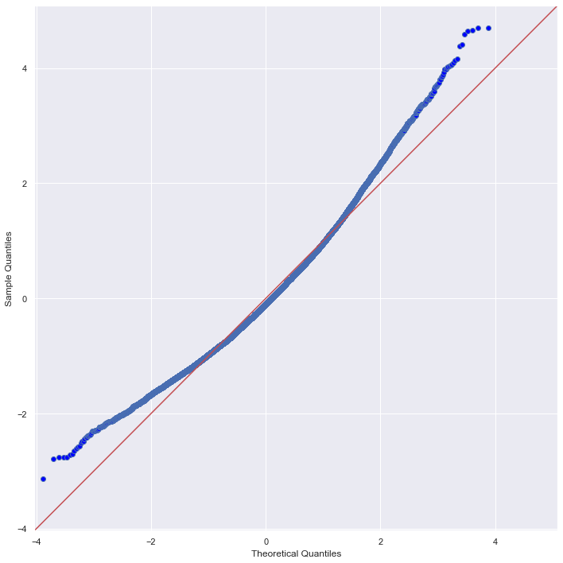
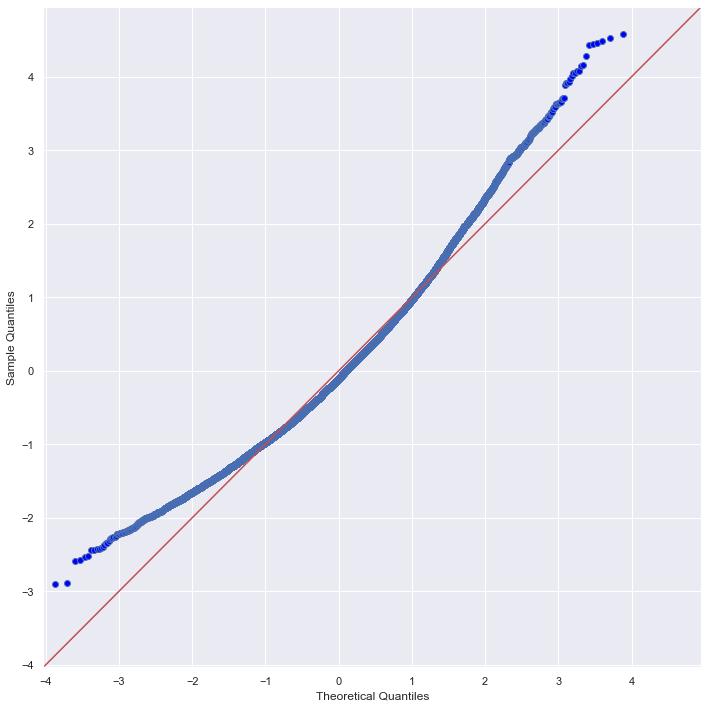
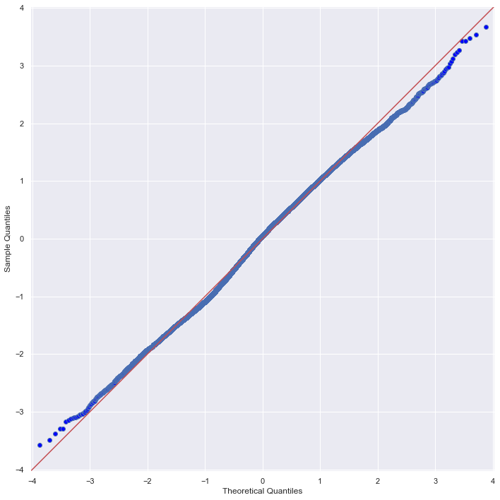
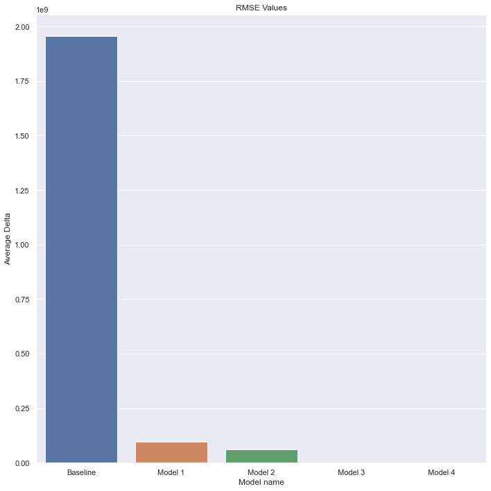

# Phase 2 Project - House Sales King County

**Author:** Ngoc Ho

**Overview**

This project aims to build a multiple linear regression model to predict house prices. This regression model can be utilized to give accurate property appraisal to homeowners and home buyers, potentially assist in property investment decisions to maximise profit. The model will be derived from King County in King County, Seattle, WA house sale dataset. The data will be explored for sigificant features and the model will be built using OLS from statsmodel library in Python. The model shows very promising accuracy in predicting property value however it has low inference value to property value. Perhaps a different model would have been more suitable for our dataset. 

**Business Problem**

A Seattle realestate company wants to establish an evaluation system for houses to provide a price appraisal and investment strategies to their clients. Having an accurate house price predictor will help the company build their reputation by gaining invaluable trust from their clients. For the client, this will help maximise their selling/investing potentials and for the company this will help increase their client number and increase commission. 

The main data analysis questions we will be focusing on are:
1. What features add value to properties?
2. Does renovation add to property value?
3. Does neighbourhood add values to property?

**Data:**
This project uses the King County House Sales dataset (kc_house_data.csv ). This dataset has 21 columns and 21597 entries of house sales in King County, Seattle, WA between 2014 and 2015. The dataset contains information on sold date, price, year built, year renovated and structure features within the property such as living area, number of bedrooms, bathrooms, floors, waterfront. It also has information on location, surrounding 15 houses's area int the neibourhood. We will examine the relationship of these features and property value using correlation analysis. These features will also be used to investigate their effect on property price and be selected to be included in a multilinear regression model to predict property value.

**Method:**

Check for data completeness and integrity
Perform EDA with statistical analysis to determine statistically significant features
Visualize statistically significant features
Engineer new features based on stastistical findings
Model Linear Regression models and evaluate each model using residual plots (check homoscedasticity) and QQ plots (check normality) for final implementation

- Baseline model ( no changes to features)
Adj-R2 : 0.702, RMSE : 1957278622.78
Very high residual errors suggesting our model is poor. 

- Model 1: Significant features are selected with outliers removed
Adj-R2 : 0.384 , RMSE : 95163669.86
Slightly better RMSE, adj-R2 reduced due to removal of insignificant features reducing multicollinearity. 
QQ-plot of residuals suggests violation of normality assumption

- Model 2: Significant features are selected with multicollinearity removed
[Heatmap]
Heatmap suggests that there are still multicollinearity in our features. After removing multicollinearity:
Adj-R2 : 0.369 , RMSE : 62506776.87

- Model 3: Normalisation of all variables using log transformation
Adj_R2: 0.371, RMSE: 392.79

Our model significantly improve after log transformation to make variables distribution more normal. Our RMSE showed significant improvement. 

- Final model: Features scalling using standardisation
Adj_R2: 0.369, RMSE: 0.00123
RSME is a perfect result showing that our model is not overfit or underfit and it yields accurate results. 

Evaluate final model using cross validation

**Evaluations:**
The final model is able to produce almost zero residual both in the test and train group which means that within linear regression this model is very accurate. With a neglegible RMSE value close to 0, this model does not seem to be underfit or overfit. It has reasonable ability to generalise beyond the dataset. However adjusted R2 value is only 0.369 which means that this model can only explain 36.9% changes in the dependent variable i.e the features in this multilinear regression model can only explain 36.9% of the property sale price which is low. I am confident that this model can accurate predict property value based on RSME results from cross validation however the model has low inference abilty given the low adjusted R2 value. Therefore, this model can is useful in accurately predicting the property value but it will fail to accurately explain how each feature of the property will affect property value.

**Conclusions**
From our final model summary, the estimated value of the coefficient indicates how much the model multiplies this independent value. sqft_living (footage of the home) has the highest estimated value of coefficient out of our 4 significant features meaning this feature adds the most value to the property. Doing a house extension might be a good idea to increase property value. However, during data exploration, renovations does not show a strong postive linear relationship with prices yet baseline model shows that it is a sigficant feature with p-value <0.05 and a coefficient of determination of 4.836e+04. In conclusion, renovation does add value to properties. The model also reveals that the size of houses in the neighbourhood does have a positive impact on property prices. 

**Limitations:**

Perhaps linear regression is not suitable for this data set. Based on RSME results from cross validation, it looks like the model can predict the property value accurately however our adjusted R2 was low, the model requires more data and a more suitable regression model to be able to give clients advised on how each feature add value to the property.

In this dataset, our categorical features are fortunately are easily converted to numerical values without using one hot encoding. Grade and bathrooms feature could've been converted to dummies however they were already in numerical values. In future cases, get_dummies function could be used.

## For More Information

Please review my full analysis in [my Jupyter Notebook](https://github.com/NBYHO/dsc-project-2-house-sales/blob/main/King_County_Housing_Model.ipynb) or my [presentation](https://github.com/NBYHO/dsc-project-2-house-sales/blob/main/King%20County%20Presentation.pdf).

For any additional questions, please contact **Ngoc Ho, yen.ho993@gmail.com**

## Repository Structure
    .
    ├── data                                # data folder
    ├── images                              # project image/graph files
    ├── King_County_Housing_Model.ipynb     # project notebook
    ├── Presentation.pdf                    # project presentation
    └── README.md
